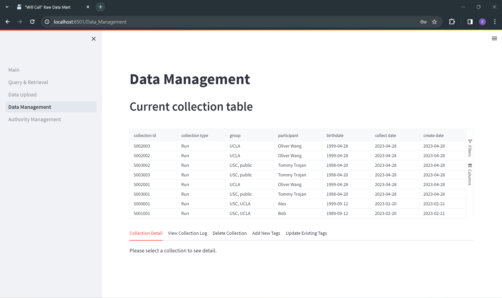

# READEME
# Development of a Raw Data Mart for Sports Medicine Analytics

## Introduction
### Welcome to the Raw Data Mart! ✌

Raw Data Mart, a Sports Biomechanics Informatics System, is positioned to facilitate the analysis and management of sports and athlete performance data. Our system offers a secure and accessible platform for `database administrators, researchers, coaches, and athletes` to store and retrieve raw data. It supports the integration of diverse multimedia data into a centralized hub, characterized by data tags. Our goal is to streamline and optimize data acquisition and storage workflows, fostering collaboration and efficiency in biomechanics research.

### What are our challenges and solutions?
In the past decade, technological advancements have introduced tools like video cameras, sensors, and force plates, facilitating the collection of athletic performance measurements. However, the current approach relies on physical hard drives and conventional cloud platforms like Google Drive to store raw data, leading to challenges such as `unorganized raw data`, `manual retrieval processes`, `insecurity`, and an overall `inefficient management steps`.

In our solution, we have established `an athlete-centric data model` utilizing `a NoSQL structure`. This approach allows relevant personnel to fine-tune the data structure and perform data queries and retrieval using data tags. We achieved seamless integration with `two cloud-based databases, Firebase and AWS S3`, to support the storage of metadata and multimedia content. Additionally, we provide `an intuitive web-based GUI`, ensuring users have a user-friendly experience at every step.

## Getting Started
### Run the Raw Data Mart
To run the web application, follow these steps:
1. Clone this repository to your local machine.
2. Install required dependencies.
```bash
pip install -r requirements.txt
```
3. Run the web application.
```bash
streamlit run Main.py
```

### Testing User
```bash
# role: admin
email: admin@usc.edu
password: admin123

# role: coach
email: coach@usc.edu
password: coach123

# role: researcher
email: research@usc.edu
password: research123

# role: athlete/participant
email: alex@usc.edu
password: alex123
```

### Build Tools: Restart database (optional):
```bash
python ./restart/start.py # restart Firebase
```

### Explore More About Our Work
- Demo Video: [Video in Google Drive](https://drive.google.com/file/d/1NOb3VxMiew_BhV0GR-0HgeL3XS2Rvkmb/view?usp=sharing)
- Presentation Slide: [Google Slide](https://docs.google.com/presentation/d/1xpGOoFGu84p9-l1-B41So_3WyWCX3pBH/edit?usp=sharing&ouid=116856484322888255076&rtpof=true&sd=true)

## System Design
### Data Model Design
Our data model takes the structure from `participants/athletes -> collections -> objects -> tags`.


The populated database corresponding to the above data model is depicted below. AWS S3 takes over the part from participants to objects and Firebase takes over the rest part.


### Methodology
Our system consists of 5 modules. The core modules are the `Data Upload Module` and `Query & Retrieval Module`. For system integrity, we included the `Data Management Module`. For system security, we introduced the `Authority Access Module` and `Authority Management Module`. 


### Feature and Highlights
- Authority Access Module


- Authority Access Module


- Welcome Page


- Data Upload Module


- Query & Retrieval Module


- Data Management Module



## System Development
### Built With
- [Streamlit](https://streamlit.io/) for frontend
- [Python](https://www.python.org/) for backend
- [Firebase Realtime Database](https://firebase.google.com/) for database (metadata)
- [Amazon S3](https://aws.amazon.com/s3/) for database (raw data)


### File Description
**1. Web Application**
- Main.py: Authority Access Module
- pages/1_Query & Retrieval.py: Query & Retrieval Module
- pages/2_Data Upload.py: Data Upload Module
- pages/3_Data Management.py: Data Management Module
- pages/Authority Management.py: Authority Management Module
- tempDir: Cache

**2. Sample Data**
- raw_data: Sample data

**3.Restart Database**
- restart/README.txt: Firebase structure
- restart/start_file.json: Restart sample data
- restart/start.py: Restart code

